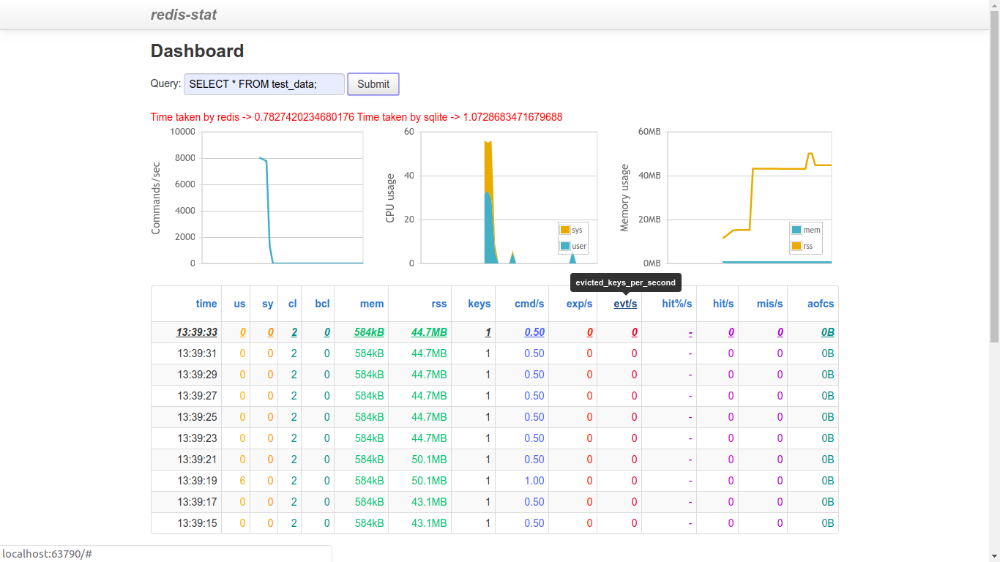
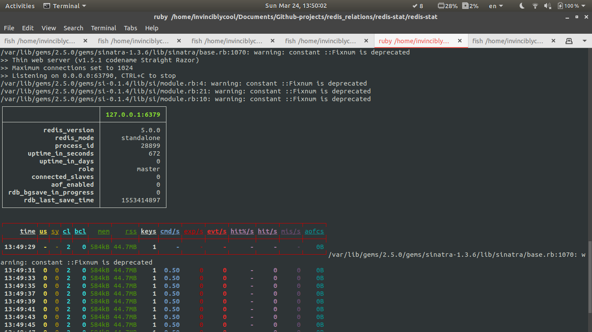
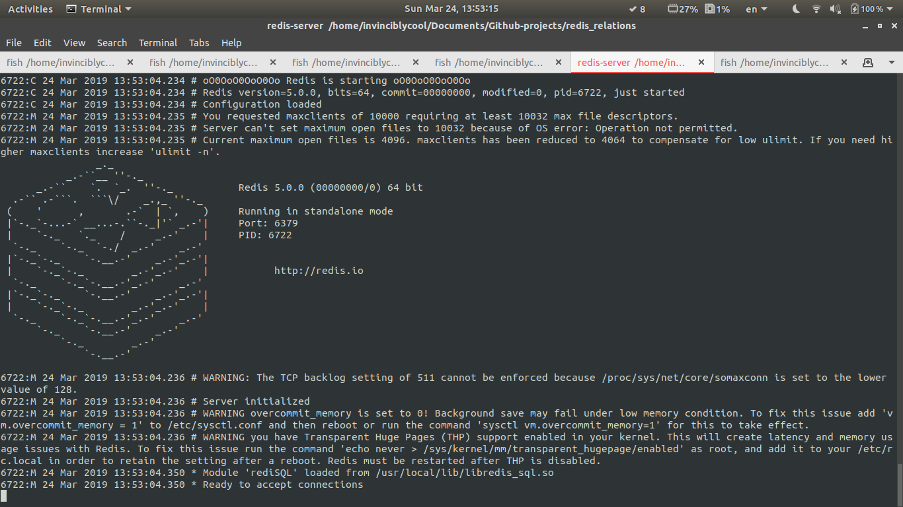
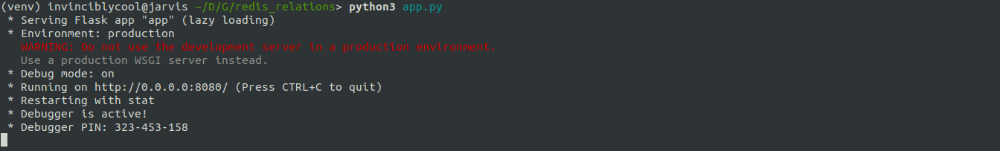

## relational_redis

#### What is relational_redis?

relational_redis is a stub for redis database to achieve relational database functionality coupled with a dashboard to
display statistics such as CPU usage, commands per/sec, hits/sec etc.

#### Why relational_redis?

relational_redis plays the role of an in-memory relational database.

#### How does it work?

 - It uses [rediSQL](https://github.com/RedBeardLab/rediSQL) to translate SQL queries on the fly and imitate relational
  database functionality on redis(which is in fact a key-value pair storage).
 - [load_db.py](https://github.com/darshkpatel/relational_redis/blob/master/load_db.py) is a utility script to seed a
  sqlite database into redis(for now the script assumes a single table in the database)
 - [conf.py](https://github.com/darshkpatel/relational_redis/blob/master/conf.py) can be used to set the database name
  and table name.
 - [data_generator](https://github.com/darshkpatel/relational_redis/blob/master/data_generator.py) was used to generate
  random data.
 
 #### Installation instructions
 
 - Install [redis](https://redis.io/download).
 - Install [rediSQL](https://github.com/RedBeardLab/rediSQL#getting-started).
 - Install requirements with `pip install -r requirements.txt`.
 - Run rediSQL either as a Docker container or as a module with the redis server.
 - Configure database and table name in `conf.py` and run `load_db.py` to seed the database into redis.
 - cd into `redis-stat/redis-stat/` and run `ruby -Ilib bin/redis-stat --server`
 - Run `python app.py`
 - Visit [localhost:63790](http://localhost:63790) to see the dashboard displaying all statistics.
 
 #### Testing
 
 Run `bash test.sh` to test the whole project with a query.

 #### Screen Grabs

 ### Dashboard

 

 ### A sample query

 

 ### Redis-stat, rediSQL and python servers

 

 

 
